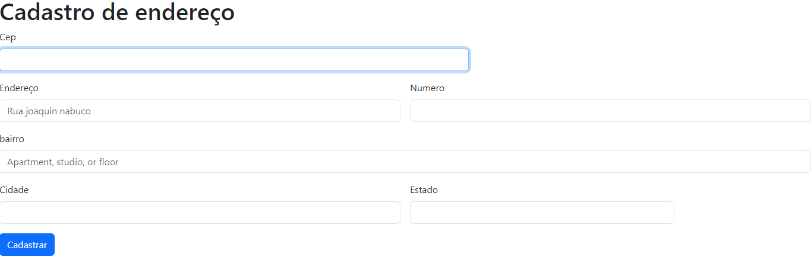

# índice

[FORM-CADENDERECO](#projeto---criando-lista-de-compra)  
[Descrição](#descri%C3%A7%C3%A3o)  
[Introdução](#introdu%C3%A7%C3%A3o)  
[Funcionalidades](#funcionalidades)  
[Tecnologia utilizada](#tecnologia-utilizadas)  
[Fontes consultadas](#fontes-consultadas)  
[Autores](#autores)

# Form-CadEndereco
Com base no exercício feito em sala, pegamos um código pronto do Bootstrap sobre um formulário de cadastro.

## Descrição 📝
 O projeto de formular cadastro é uma maneira que encontramos para manter as informações dos clientes organizadas.

## Introdução❗
Ferramenta que auxilia as empresas a manter as informações organizada
A ferramenta foi criadoa para facilitar e ajudar as empresas com suas organizações.

## Funcionalidades⚙️
Ao acessar essa ferramenta o usuário será direcionado para uma página, lá está pedindo as seguintes funções, sendo elas:
- `Cep`: O usuário terá que colocar o cep. Exemplo 124352718  
-  `Endereço`: Esse campo será utilizado para adiconar o Endereço. 𝓔𝔁𝓮𝓶𝓹𝓵𝓸: Rua das maritacas  
- `Numero`: O usuario devera colocar o numero de sua residencia. 𝓔𝔁𝓮𝓶𝓹𝓵𝓸: 123
- `Cidade`: Aqui o úsuario devera colocar sua cidade. 𝓔𝔁𝓮𝓶𝓹𝓵𝓸: Londrina
- `Estado`:  E para finaliza o usuario devera colocae seu estado. 𝓔𝔁𝓮𝓶𝓹𝓵𝓸:Parana
